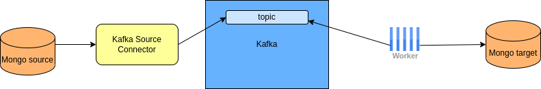

# Problem:

We have a source data - mongodb. And, we have a source target data - also mongodb.
We want to migrate data from the source to the target storage with minimal downtime for services that work with source db and the target db.
Let’s assume that our source db has many apps working with it (more than 100), all of them are writing/reading/updating source db.
Also, there are more than 100 services that work with target db. They also write/read a lot.
There is a database named “test” in the source db. A collection of “users” exists in the “test”, the users collection has a document structure (mongodb)

now we have a problem... The developers first had a MongoDb schema in the users collection like this

  "_id": Number(),

  "firstname": String(),

  "lastname": String(),

  "age": Number(),

  "email": String()

then other developers came and something changed, now the scheme is like this:

   "_id": Number(),

   "firstname": String(),

   "lastname": String(),

   "age": Number(),

   "email": String(),

   "sex": String(),

# Requirement:
Get the structure from the source db/test/users to target db/test/users saving all data.
Ensure the migration of data from the source db to the target db while maintaining the data structure.
We need to use:
+ Kafka in a single-node installation mongodb Source.
+ Kafka in a single-node installation mongodb Target
+ Kafka in a single-node installation kafka-connect in a single-node installation
+ Worker in a single-node installation that read from kafka topics and write to target DB

# Note:
Need to use Docker Image because services are many
It’s desirable to create an overlay network, run containers on the network and refer to container name as “dns”
In order for this task to be solved, it’s just not possible to read data in mongoDb, reactivity is needed, reactivity is achieved through reading the Oplog log collection.
Operation Log This oplog is only available after the base has started in replicaSet mode. The ReplicaSet mode does not require a cluster, you can run it on one mongoDB node, but if you want, you can raise the full replicaSet in at least three nodes.

# Architecture

# Run book

1. Start Kafka Connect and MongoDB environment

`docker-compos up --build`

Wait until all services get running. Open two interactive shells:

**shell_source:**

`docker exec -it mongo-source /bin/bash`

**shell_target:**

`docker exec -it mongo-target /bin/bash`

2. Generate data for Mongo Source
**shell_source:**

`python3 ./gen_data.py`

It should be prompted **Data inserted successfully!**

Connect to mongodb

`mongosh "mongodb://mongo-source"`

`db.users.countDocuments()`

It should prompted **100** (since we have generated 100 records to the users collection)

3. Configure the Source Connector

`vim kafka-source-connect.json`

**Copy the following config to the vim editor:**

    {
        "name": "mongo-source-connect",

        "config": {

            "connector.class": "com.mongodb.kafka.connect.MongoSourceConnector",
            "connection.uri": "mongodb://mongo-source",
            "database": "test",
            "collection": "users",
            "startup.mode": "copy_existing"
        }
    }

**Start the source connector**

`cx kafka-source-connect.json`

**Monitor status of source connector**

`status`

If your source connector started successfully, you should see the following output:

{

    `Kafka topics:

    "topic": "docker-connect-status",
    "topic": "__consumer_offsets",
    "topic": "test.users",
    "topic": "docker-connect-offsets",
    "topic": "docker-connect-configs"
    ...

    The status of the connectors:

    source  |  mongo-cdc-source  |  RUNNING  |  RUNNING  |  com.mongodb.kafka.
    connect.MongoSourceConnector

    Currently configured connectors

    [

    "mongo-source-connect"

    ]
    ...

    `
}

4. **Monitor topic test.users**

`kc test.users`

Wait until it prompts "... at offset 100", it means that kafka has consumed all records from MongoDb through Kafka Source Connector:

**...% Reached end of topic test.users [0] at offset 100**

5. **Check worker read the topic and write to Mongo Target**

Open **shell_target**:

**Check if mongo-target is written by worker**:

`mongosh "mongodb://mongo-target"`

`db.users.countDocuments()`

It should prompt:

`100`

1. Test add new record to mongo source and worker will sync it to mongo target

Open shell_source:

We're gonna insert new record into mongo-source:

`mongosh "mongodb://mongo-source"`

db.users.insertOne({
  "firstname": "duc",
  "lastname": "nguyen",
  "age": 22,
  "email": "itsme@gmail.com",
  "sex": "female"
})

**Check kafka offset**

`status`

It should prompt:

**...% Reached end of topic test.users [0] at offset 101**

**Check mongo-target is sync with new data**

`mongosh "mongodb://mongo-target"`

`db.users.countDocuments()`

It should prompt:

`101`

# Conclusion:

We created worker as python script which read data from kafka topic and write it to Mongo Target. By this approach, Mongo target doesn't need to subcribe to the kafka topic. Event is consumed by worker and then write to target db.

How can we apply it in practice?
    Let's say we using 3rd-party service such as Amazon Cognito. We keep writing "users" data to both Amazon Cognito and our Backend DB. For example, we don't want to save all unnecesary fields such as "age" or "sex" (the less data - the less money charging), then this approach using worker as a filter is good idea. Because sometimes we can't aware of what objects sent to DB by clients, using a filter is a safe way to specify which fields are written to db. Moreover, it's also scalable, we can scale number of instances of worker.
