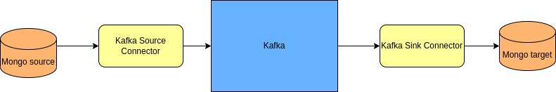

# Problem:

We have a source data - mongodb. And, we have a source target data - also mongodb.
We want to migrate data from the source to the target storage with minimal downtime for services that work with source db and the target db.
Let’s assume that our source db has many apps working with it (more than 100), all of them are writing/reading/updating source db.
Also, there are more than 100 services that work with target db. They also write/read a lot.
There is a database named “test” in the source db. A collection of “users” exists in the “test”, the users collection has a document structure (mongodb)

{
  "_id": Number(),
  "firstname": String(),
  "lastname": String(),
  "age": Number(),
  "email": String()
}

# Requirement:
Get the structure from the source db/test/users to target db/test/users saving all data.
Ensure the migration of data from the source db to the target db while maintaining the data structure.
We need to use:
+ Kafka in a single-node installation mongodb Source.
+ Kafka in a single-node installation mongodb Target
+ Kafka in a single-node installation kafka-connect in a single-node installation

# Note:
Need to use Docker Image because services are many
It’s desirable to create an overlay network, run containers on the network and refer to container name as “dns”
In order for this task to be solved, it’s just not possible to read data in mongoDb, reactivity is needed, reactivity is achieved through reading the Oplog log collection.
Operation Log This oplog is only available after the base has started in replicaSet mode. The ReplicaSet mode does not require a cluster, you can run it on one mongoDB node, but if you want, you can raise the full replicaSet in at least three nodes.

# Architecture

# Run book

1. Start Kafka Connect and MongoDB environment

`docker-compose -p mongo-kafka-connect up`

Wait until all services get running. Open two interactive shells:

**shell_source:**

`docker exec -it mongo-source /bin/bash`

**shell_target:**

`docker exec -it mongo-target /bin/bash`

2. Generate data for Mongo Source
**shell_source:**

`python3 ./gen_data.py`

It should be prompted **Data inserted successfully!**

Connect to mongodb

`mongosh "mongodb://mongo-source"`

`db.users.countDocuments()`

It should prompted **100** (since we have generated 100 records to the users collection)

3. Configure the Source Connector

`vim kafka-source-connect.json`

**Copy the following config to the vim editor:**

    {
        "name": "mongo-source-connect",

        "config": {

            "connector.class": "com.mongodb.kafka.connect.MongoSourceConnector",
            "connection.uri": "mongodb://mongo-source",
            "database": "test",
            "collection": "users",
            "startup.mode": "copy_existing"
        }
    }

**Start the source connector**

`cx kafka-source-connect.json`

**Monitor status of source connector**

`status`

If your source connector started successfully, you should see the following output:

{

    `Kafka topics:

    "topic": "docker-connect-status",
    "topic": "__consumer_offsets",
    "topic": "test.users",
    "topic": "docker-connect-offsets",
    "topic": "docker-connect-configs"
    ...

    The status of the connectors:

    source  |  mongo-cdc-source  |  RUNNING  |  RUNNING  |  com.mongodb.kafka.
    connect.MongoSourceConnector

    Currently configured connectors

    [

    "mongo-source-connect"

    ]
    ...

    `
}

4. **Monitor topic test.users**

`kc test.users`

Wait until it prompts "... at offset 100", it means that kafka has consumed all records from MongoDb through Kafka Source Connector:

**...% Reached end of topic test.users [0] at offset 100**

5. **Config And Start Sink Connector**

Open **shell_target**:

**Check if mongo-target is empty at the moment**:

`mongosh "mongodb://mongo-target"`

`db.users.countDocuments()`

It should prompt:

`0`

**Config Sink Connector**

`vim kafka-sink-connector`

Paste following config to the vim editor:

    {
        "name": "mongo-sink-connect",
        "config": {
            "connector.class": "com.mongodb.kafka.connect.MongoSinkConnector",
            "topics": "test.users",
            "change.data.capture.handler": "com.mongodb.kafka.connect.sink.cdc.mongodb.ChangeStreamHandler",
            "connection.uri": "mongodb://mongo-target",
            "database": "test",
            "collection": "users"
        }
    }

**Start Sink connector**
`cx kafka-sink-connector.json`

**Check if mongo-target is now sync with mongo-source**

`mongosh "mongodb://mongo-target"`

`db.users.countDocuments()`

It should prompt:

`0`

6. Test Change Data Capture Handler

Open shell_source:

We're gonna insert new record into mongo-source:

`mongosh "mongodb://mongo-source"`

db.users.insertOne({
  "firstname": "duc",
  "lastname": "nguyen",
  "age": 22,
  "email": "itsme@gmail.com"
})

**Check kafka offset**

`status`

It should prompt:

**...% Reached end of topic test.users [0] at offset 101**

**Check mongo-target is sync with new data**

`mongosh "mongodb://mongo-target"`

`db.users.countDocuments()`

It should prompt:

`101`

# Conclusion:

We solved the problem of migrating data from existing MongoDB data source to MongoDB data sink by using Kafka Connect.
By startup, Connector fetches all existing data from Mongo Source to Kafka. We monitor this process and wait until all data gets synced completely.
Then, let mongo Target start consuming data from Kafka. From now, all new opeartions to Mongo Source have synced to Mongo Target. We can **gracefully** change the Mongo config which apps have been interacting with.

As a result, downtime = time switching DB (**Gracefully shutdown**)
